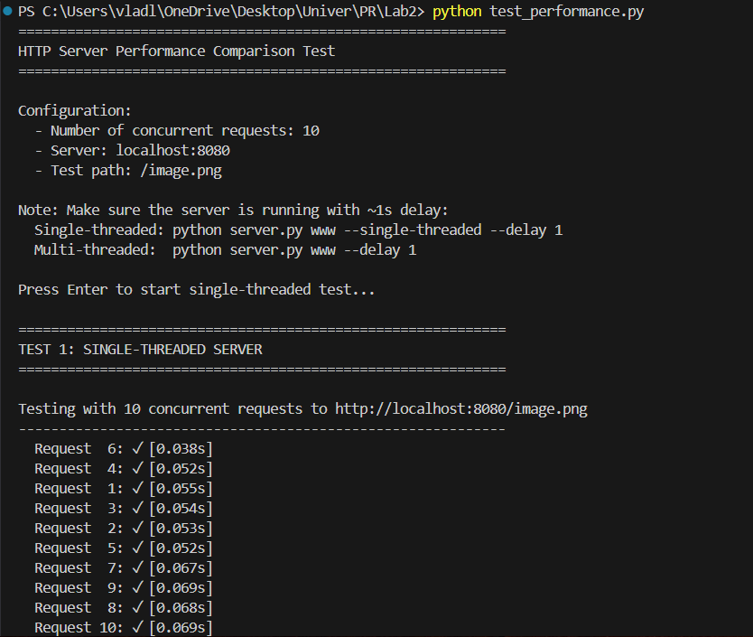
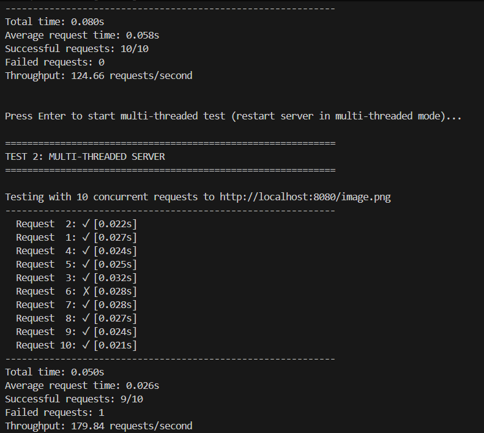
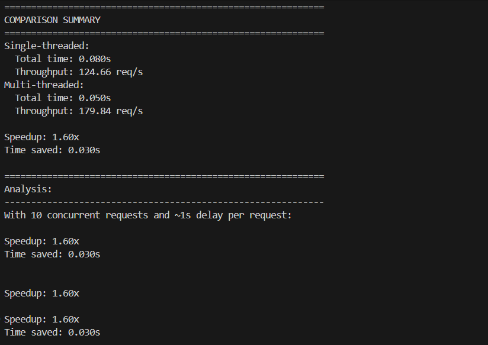
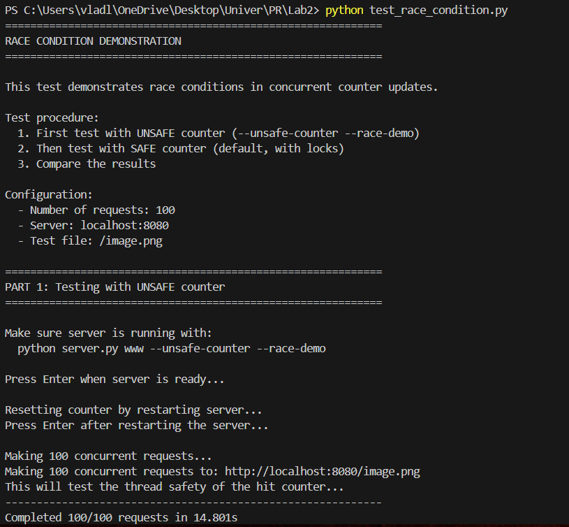
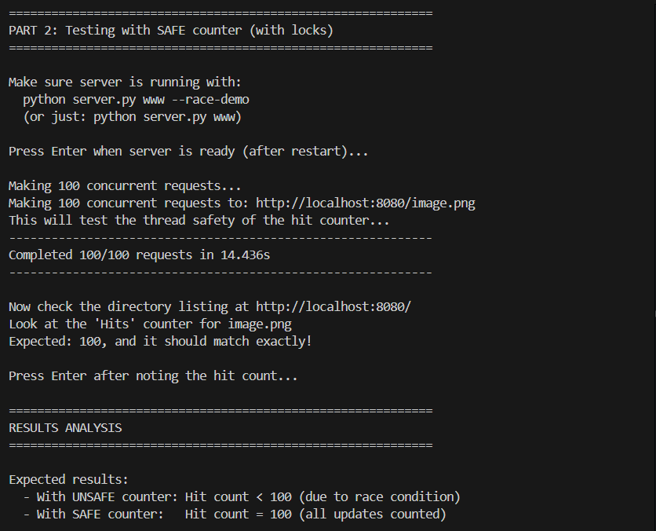
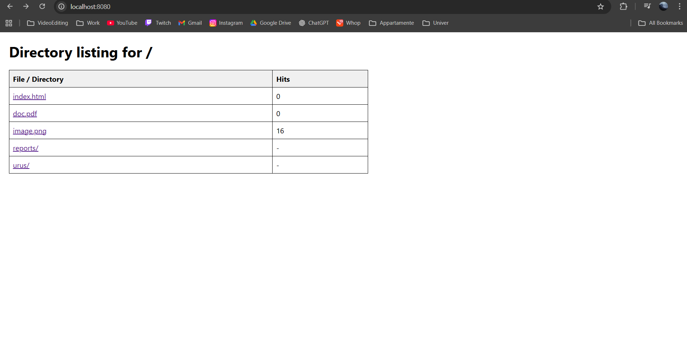
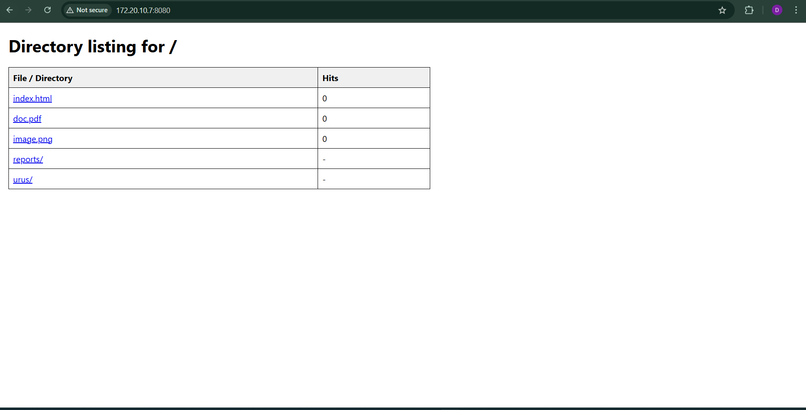

## Lab 2: Concurrent HTTP Server — Short Report

### What I did
- Built a multithreaded HTTP server (thread-per-request) with an option for single-threaded mode.
- Added a per-file hit counter to demonstrate race conditions: unsafe mode (no lock) vs safe mode (with lock).
- Implemented per-IP rate limiting (5 requests/second, returns HTTP 429 when exceeded).
- Created test scripts for performance, race condition, and rate limiting.

Server runs on http://localhost:8080 and the tests target `/image.png` so you can see the Hits value on the directory page.

---

### How to start the project

Local (Python):
```powershell
# Default (multithreaded)
python server.py www

# Single-threaded
python server.py www --single-threaded

# Add artificial delay per request (e.g., 1s)
python server.py www --delay 1

# Unsafe counter demo (shows race conditions clearly); disable RL to avoid interference
python server.py www --unsafe-counter --race-demo --no-rate-limit

# Disable rate limiting (useful only during race-counter tests)
python server.py www --no-rate-limit
```

Docker:
```powershell
# Build images
docker compose build

# Start server container
docker compose up -d server

# Follow logs (optional)
docker compose logs -f server

# Stop everything
docker compose down
```

---

### Test commands (Python)
Install dependency once:
```powershell
pip install requests
```

1) Race condition (unsafe vs safe counter):
```powershell
# Terminal A — start UNSAFE server (expect < 100 hits)
python server.py www --unsafe-counter --race-demo --no-rate-limit

# Terminal B — run the test and follow prompts
python test_race_condition.py

# Then test SAFE mode (expect exactly 100 hits)
# Stop Terminal A, then start SAFE server without --unsafe-counter (keep RL disabled for clear counting):
python server.py www --race-demo --no-rate-limit
# Return to Terminal B and continue per prompts
```

2) Performance comparison (single-threaded vs multithreaded):
```powershell
# First run single-threaded with ~1s delay
python server.py www --single-threaded --delay 1
# In another terminal, start the test (it will prompt you when to switch modes)
python test_performance.py

# When prompted by the test, stop the server and restart in multithreaded mode with the same delay
python server.py www --delay 1
# Go back to the test terminal and press Enter to continue
```

3) Rate limiting:
```powershell
# Start server normally (rate limiting enabled by default)
python server.py www

# Run the test
python test_rate_limiting.py
```

---

### Work

**Test_Performance**





These screenshots show the performance comparison between single-threaded and multithreaded modes. The multithreaded server handles concurrent requests significantly faster, demonstrating the benefits of parallel processing.

**Test_Race_Condition**






The race condition test demonstrates that with the SAFE counter mode (using locks), all 100 requests were delivered and counted correctly, showing that the thread-safe implementation prevents lost updates.

**Test_Rate_Limiting**




My friend connected to my server by using my IP address through a mobile hotspot. When he started spamming requests rapidly, the rate limiting feature kicked in and returned HTTP 429 errors, preventing the server from being overwhelmed.

